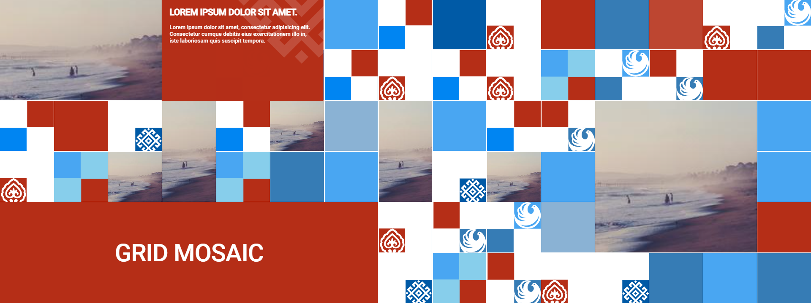

# Installation

```bash
npm install grid-mosaic
```

# Initialization

###### HTML
1) Add container to your page with class "mosaic".
2) Add items with class "mosaic-item" to the container.

```bash

<div class="mosaic">

    <a href="/test" class="mosaic-item">
        
    </a>
    
    or 
    
     
     
    or you can add any addition html that might be needed
    
     <a href="/" target="_blank" class="mosaic-item">
        
        <div class="mosaic__tooltip">
            <div class="mosaic__tooltip-title">Title</div>
            <div class="mosaic__tooltip-content">Content</div>
        </div>
    </a>

</div>
```

###### JS
3) Initialise the app in your js file with default set up or modify it in option object.

```bash
new Mosaic(".mosaic" || node, options (optional))
```

# Demo



https://benjamindickens.github.io/grid-mosaic-demo/

# Options

###### measure
This important because in further options if you choose sizes you enter only number,
what is added at the end will depend on this option.
```bash
measure = "px" / "em" / "rem" || default: "px";
```

###### maxTries
The max amount of tries of calculation an item position.
```bash
maxTries = number || default: 60 ;
```

###### breakpoint
Query value that applies data when recalculation needs to be done because of device view port.
```bash
breakpoint = number || default: 667;
```

###### otherElements
Takes array of objects to specify places occupied in current mosaic and places them.
```bash
otherElements = [{
        el: document.querySelector(".js-caption"),
        coordinates: {
            desktop: [5,1,2,7],
            mobile: [1,2,4,3]
          }
        }, {....}] || default: [];
```

###### bg
Draw addition background items to take over all container.
```bash
bg = true / false || default: true;
```

###### bgStyles
Object of rules for background elements you may specify just main color for all.
or it takes array of classes that will be implemented to elements in random sequence.
```bash
bgStyles = {
        background: #bada55 || default : #FFFFFF,
        classes: ["class-1", "class-2" ...] || default: null
        };
```

###### bgAnimation
Specify rules for bg animation by default its running you might want to set delay to 0 or false to prevent.
Effects - allow you to pass classes that will make the animations itself.
```bash
bgAnimation = {
            delay: number / false || default : 8000,
            effects: ["_slide-0", "slide-1" ...] || default : ["_illuminate-0", "_illuminate-1", "_illuminate-2", "_illuminate-3"]
        }
```

###### noSausagePatterns
Prevent items from a bad aspect ratio. 
```bash
noSausagePatterns = true / false || default : true;
```

###### randomItems
Shuffle elements in container to get the random sequence after page reload.
```bash
randomItems = false / true || default : true;
```

###### gaps
Specify grid-gap, you can do in css
```bash
gaps = {
        desktop: number || default: 0,
        mobile: number || default: 0,
       };
```

###### items
Specify items of mosaic.
```bash
items = [...] || default: document.querySelectorAll(".mosaic-item");
```

###### autoplay
options of default change animation you might turn it off to set up delay as 0 or false.
```bash
autoplay = {
            delay:  number / false || default : 3500,
            effect: false / "default" || default : "default",
            preventDefaultHover: true / false || default :  false,
            opacityDefaultOutDuration: number || default: 500,
        };
```

###### dimension
Set dimension for grid container. Size is options that shows "min-width" and "height" of cell.
default behavior that is max-width for cell is 1fr.If you want to prevent this set up "width" for container
```bash
dimension = {
            desktop: {
                cols: number || default : 5,
                rows: number || default : 5,
                size: number || default : 90
            },
            mobile: {
                cols: number || default : 3,
                rows: number || default : 6,
                size: number || default : 90
            },
        };
```

###### maxItems
Max amount of items that might be shown in one round of animation.
```bash
maxItems = {
            desktop: number || default: null,
            mobile: number || default: null,
        };
```

###### maxSize
Max size of items.
```bash
maxSize = {
            desktop: {
                y: number || default: 3,
                x: onumber || default: 3,
            },
            mobile: {
                y: number || default: 3,
                x: number || default: 3,
            }
        };
```

###### on
Here you might add your custom functions.
```bash
on = {
            mouseEnter: () => { your code ...} || default: null,
            mouseLeave: func || default: null,
            beforeInit: func || default: null,
            afterInit: func || default: null
        }
```